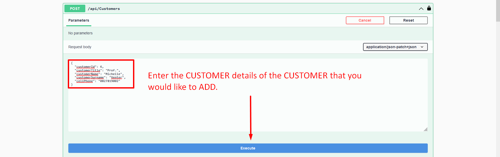
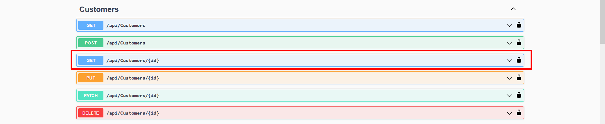
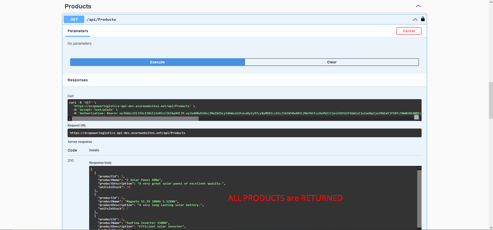

# CMPG 323 Project 2 - 33152985

### LOGIN DETAILS FOR DEMO ADMIN ACCOUNT

"username": "demoadmin",
"password": "Demo@123"

### HOW TO USE THE API

### CUSTOMERS

## GET ALL CUSTOMERS

## ADD A CUSTOMER

## GET SPECIFIC CUSTOMER

## UPDATE CUSTOMER

## PARTIAL UPDATE CUSTOMER

## REMOVE CUSTOMER

### PRODUCTS

## GET ALL PRODUCTS

## ADD A PRODUCT

## GET PRODUCT BY ID

## UPDATE PRODUCT

## PARTIAL UPDATE PRODUCT

## REMOVE PRODUCT

## GET PRODUCT BY ORDER

