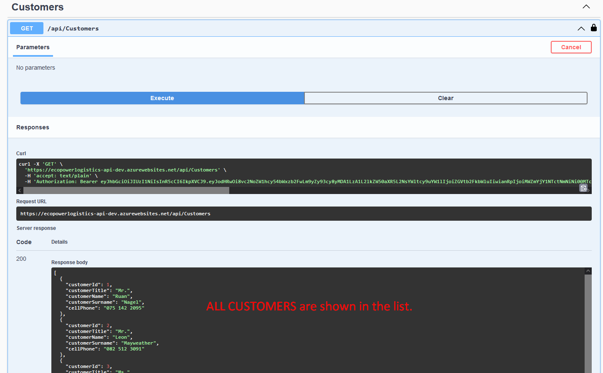

# CMPG 323 Project 2 - 33152985

## REFERENCES

### LOGIN DETAILS FOR DEMO ADMIN ACCOUNT

Link for API: https://ecopowerlogistics-api-dev.azurewebsites.net/index.html  
"username": "demoadmin",  
"password": "Demo@123"

## HOW TO USE THE API

## CUSTOMERS

### GET ALL CUSTOMERS

### ADD A CUSTOMER

### GET SPECIFIC CUSTOMER

### UPDATE CUSTOMER

### PARTIAL UPDATE CUSTOMER

### REMOVE CUSTOMER

## PRODUCTS

### GET ALL PRODUCTS

### ADD A PRODUCT

### GET PRODUCT BY ID

### UPDATE PRODUCT

### PARTIAL UPDATE PRODUCT

### REMOVE PRODUCT

### GET PRODUCT BY ORDER

## ORDERS

### GET ALL ORDERS

### ADD AN ORDER

### GET ORDER BY ID

### UPDATE ORDER

### PARTIALLY UPDATE ORDER

### REMOVE AN ORDER

### GET ORDER BY CUSTOMER ID

## ORDER DETAILS

### GET ALL ORDER DETAILS

### ADD AN ORDER DETAIL

### GET ORDER DETAIL BY ID

### UPDATE ORDER DETAIL

### PARTIALLY UPDATE ORDER DETAIL

### REMOVE ORDER DETAIL

## 401 AUTHORIZATION ERROR

